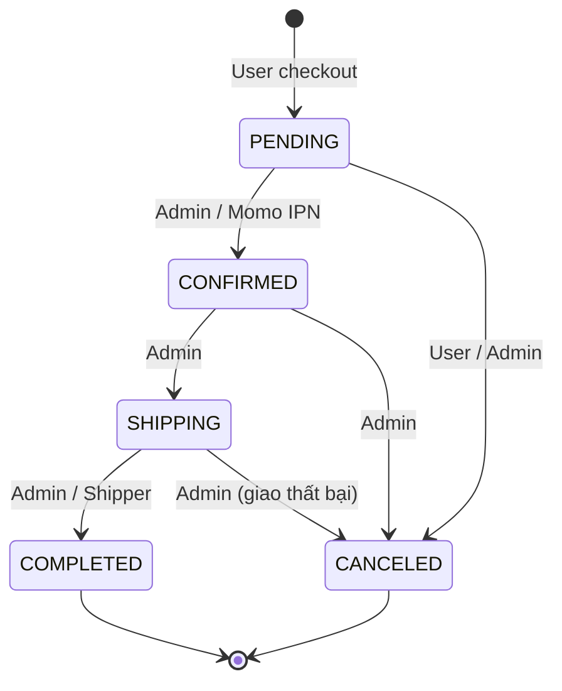
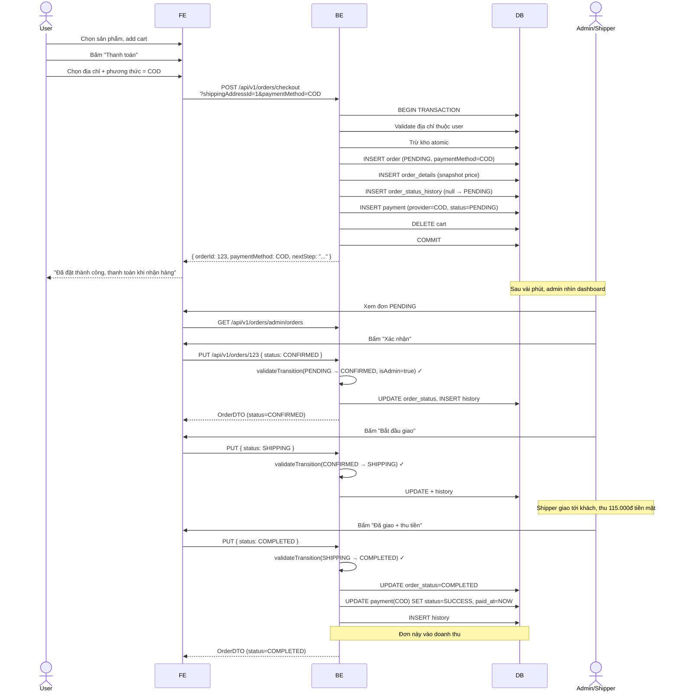
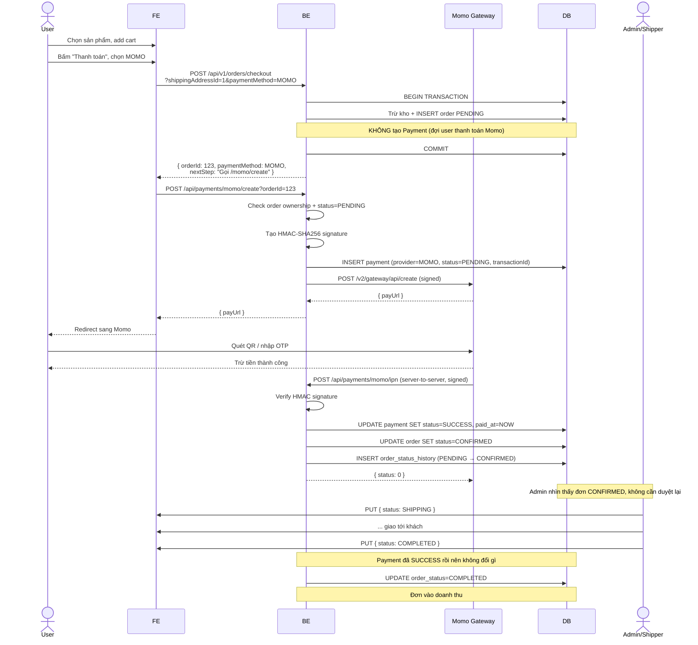
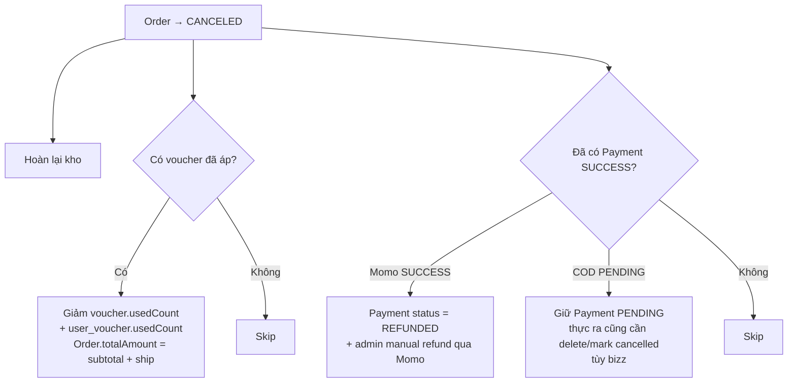

# Hướng dẫn nghiệp vụ COD + Luồng đặt hàng mới nhất

> Cập nhật cho version sau khi rút gọn OrderStatus và thêm Cash on Delivery (COD).
> Đối tượng: dev FE, dev BE, người test (QA), người quản lý nghiệp vụ.

## Mục lục
1. [TL;DR — Tóm tắt 1 phút](#1-tldr)
2. [Nghiệp vụ kinh doanh](#2-nghiệp-vụ-kinh-doanh)
3. [Phương thức thanh toán](#3-phương-thức-thanh-toán)
4. [Trạng thái đơn hàng](#4-trạng-thái-đơn-hàng)
5. [Phân quyền chuyển trạng thái](#5-phân-quyền-chuyển-trạng-thái)
6. [API thay đổi](#6-api-thay-đổi)
7. [Luồng COD đầy đủ — bước theo bước](#7-luồng-cod)
8. [Luồng MOMO đầy đủ — bước theo bước](#8-luồng-momo)
9. [Luồng hủy đơn](#9-luồng-hủy-đơn)
10. [Test trên Postman](#10-test-trên-postman)
11. [Lỗi thường gặp](#11-lỗi-thường-gặp)

---

## 1. TL;DR

- **Bỏ status**: `DELIVERED`, `RETURNED` → còn 5 status
- **Thêm 2 phương thức thanh toán**: `COD` (mặc định) và `MOMO`
- **API mới**: `POST /api/v1/orders/checkout` nhận thêm param `paymentMethod=COD|MOMO`
- **Doanh thu**: chỉ tính đơn `COMPLETED` (đã thu đủ tiền)
- **State machine chặt**: user chỉ hủy được khi `PENDING`, admin quản lý mọi chuyển khác

---

## 2. Nghiệp vụ kinh doanh

### Bán gì?
Đồ uống F&B (trà sữa, nước ép, cà phê, soft drink). Đặc thù:
- Khách nhận → uống ngay → **không trả lại được**
- Đơn xử lý nhanh, không cần grace period
- COD là phương thức phổ biến nhất ở VN

### Vì sao bỏ `DELIVERED` và `RETURNED`?
- **DELIVERED tách riêng COMPLETED** chỉ cần khi có chính sách "trả hàng trong N ngày". Đồ uống không có → gộp 1 trạng thái.
- **RETURNED** cho đồ uống không hợp lý (uống xong không trả lại được).

→ Flow rút gọn: shipper giao xong + thu tiền = `COMPLETED` luôn.

---

## 3. Phương thức thanh toán

```java
enum PaymentMethod {
    COD,    // Cash on Delivery
    MOMO    // Ví điện tử Momo
}
```

### So sánh

| | COD | MOMO |
|---|---|---|
| Khi nào trả tiền | Khi nhận hàng | Trước khi giao |
| Khi nào tạo Payment record | Ngay khi checkout (PENDING) | Khi user bấm "Thanh toán Momo" |
| Khi nào Payment chuyển SUCCESS | Khi admin bấm `COMPLETED` đơn | Khi Momo IPN báo OK |
| Rủi ro shop | Khách không nhận hàng → tốn ship | Không (đã thu tiền trước) |
| Trải nghiệm user | Đơn giản, không cần app Momo | Phải có Momo, OTP, v.v. |

### Bắt buộc dùng phương thức nào?
Hiện default = **COD**. FE có thể cho user chọn ở màn checkout (dropdown / radio button).

---

## 4. Trạng thái đơn hàng



### Mô tả từng status

| Status | Ý nghĩa | Side effect |
|---|---|---|
| `PENDING` | Vừa tạo, đang chuẩn bị | Stock đã trừ, COD: Payment PENDING |
| `CONFIRMED` | Đã thanh toán Momo HOẶC admin duyệt COD | (chỉ đổi status) |
| `SHIPPING` | Đang giao tới khách | (chỉ đổi status) |
| `COMPLETED` | Đã giao + thu tiền xong | **Tính doanh thu**; COD Payment → SUCCESS |
| `CANCELED` | Hủy đơn | Stock hoàn lại; Voucher hoàn lại; Momo Payment → REFUNDED |

---

## 5. Phân quyền chuyển trạng thái

Logic chặt trong `OrderService.validateTransition`. **Mỗi lần FE gọi `PUT /api/v1/orders/{id}` đều bị check**.

| Từ → Đến | Ai có quyền | Note |
|---|---|---|
| **null → PENDING** | User (auto khi `/checkout`) | |
| **PENDING → CONFIRMED** | Admin (manual) hoặc Momo IPN | |
| **PENDING → CANCELED** | User chính chủ HOẶC admin | User chỉ cancel khi PENDING |
| **CONFIRMED → SHIPPING** | Admin | |
| **CONFIRMED → CANCELED** | Admin | User KHÔNG cancel được sau khi đã thanh toán |
| **SHIPPING → COMPLETED** | Admin/Shipper | Trigger COD Payment SUCCESS |
| **SHIPPING → CANCELED** | Admin | Giao thất bại |
| **COMPLETED → \*** | KHÔNG AI | Terminal state |
| **CANCELED → \*** | KHÔNG AI | Terminal state |
| **\* → PENDING** | KHÔNG AI | Không thể quay ngược |

### Code reference
`Service/Class/OrderService.java` → method `validateTransition`.

---

## 6. API thay đổi

### Endpoint duy nhất bị ảnh hưởng

#### `POST /api/v1/orders/checkout`

**Thêm param mới**:
| Param | Type | Required | Default | Giá trị |
|---|---|---|---|---|
| `shippingAddressId` | int | ✅ | — | ID địa chỉ giao (phải thuộc user) |
| `voucherCode` | string | ❌ | null | Mã voucher (nếu có) |
| `note` | string | ❌ | null | Ghi chú |
| **`paymentMethod`** | enum | ❌ | `COD` | `COD` hoặc `MOMO` |

**Response thay đổi**:

Trước:
```json
{ "orderId": 123 }
```

Sau:
```json
{
  "orderId": 123,
  "paymentMethod": "COD",
  "nextStep": "Đơn COD đã ghi nhận, thanh toán khi nhận hàng"
}
```

Với MOMO:
```json
{
  "orderId": 123,
  "paymentMethod": "MOMO",
  "nextStep": "Gọi POST /api/payments/momo/create?orderId=123 để lấy payUrl"
}
```

→ FE dựa vào `nextStep` để biết bước tiếp theo cần làm gì.

### Endpoint không đổi nhưng behavior khác

#### `PUT /api/v1/orders/{orderId}`
- Body cũ: `{ "status": "DELIVERED" }` → **không còn dùng được**
- Status hợp lệ: `PENDING, CONFIRMED, SHIPPING, COMPLETED, CANCELED`
- Phân quyền chặt (xem mục 5)
- Khi đổi sang `COMPLETED` đơn COD → tự động đánh dấu Payment(COD) SUCCESS
- Khi đổi sang `CANCELED` đơn đã SUCCESS (Momo) → Payment chuyển REFUNDED

#### `GET /api/v1/orders/admin/revenue`
- Trước: tính đơn `DELIVERED + COMPLETED`
- Sau: chỉ tính `COMPLETED` (chính xác — đã thu tiền thật)

---

## 7. Luồng COD



### Tóm tắt các bước

| Bước | Ai | API | Status sau |
|---|---|---|---|
| 1 | User | `POST /checkout?paymentMethod=COD` | PENDING |
| 2 | Admin | `PUT /{id} {status:CONFIRMED}` | CONFIRMED |
| 3 | Admin | `PUT /{id} {status:SHIPPING}` | SHIPPING |
| 4 | Admin/Shipper | `PUT /{id} {status:COMPLETED}` | COMPLETED + Payment SUCCESS |

---

## 8. Luồng MOMO



### Tóm tắt các bước

| Bước | Ai | API | Status |
|---|---|---|---|
| 1 | User | `POST /checkout?paymentMethod=MOMO` | Order PENDING |
| 2 | User (FE auto) | `POST /momo/create?orderId=` | Lấy payUrl |
| 3 | User | (redirect Momo, thanh toán) | — |
| 4 | Momo | `POST /momo/ipn` (server-to-server) | Order **CONFIRMED**, Payment SUCCESS |
| 5 | Admin | `PUT {status:SHIPPING}` | SHIPPING |
| 6 | Admin/Shipper | `PUT {status:COMPLETED}` | COMPLETED (đã thu tiền từ bước 4) |

---

## 9. Luồng hủy đơn

### Khi nào user hủy được
- **Chỉ khi đơn ở PENDING** (chưa admin duyệt, chưa thanh toán)
- Sau đó: gọi support → admin hủy giúp

### Khi nào admin hủy được
- **PENDING / CONFIRMED / SHIPPING** đều cancel được
- Không cancel được đơn `COMPLETED` (đã giao + thu tiền)

### Hậu quả khi cancel



### Code reference
`OrderService.updateOrder` → block xử lý CANCELED:
1. Hoàn kho atomic (`productSize.quantity += orderDetail.quantity`)
2. Hoàn voucher (`rollbackVoucher`)
3. Nếu có Payment SUCCESS → REFUNDED

---

## 10. Test trên Postman

### Setup
1. Tạo Environment `Shopfood Dev` (xem [API_GUIDE.md mục Setup](API_GUIDE.md))
2. Đăng ký + verify email + login (lưu accessToken vào env)
3. Tạo địa chỉ giao hàng: `POST /api/shipping-addresses`

### Scenario 1: COD success

```
1. POST /api/carts/add
   Body: { productId: 1, productSizeId: 1, quantity: 2 }
   → 200 "Added to cart"

2. POST /api/v1/orders/checkout?shippingAddressId=1&paymentMethod=COD
   → 200 { orderId: 1, paymentMethod: COD, nextStep: "Đơn COD..." }

3. Login admin (set role ADMIN trong DB)
4. PUT /api/v1/orders/1
   Body: { "status": "CONFIRMED" }
   → 200 OrderDTO

5. PUT /api/v1/orders/1
   Body: { "status": "SHIPPING" }
   → 200

6. PUT /api/v1/orders/1
   Body: { "status": "COMPLETED" }
   → 200

7. Check DB:
   SELECT status FROM payments WHERE order_id=1;
   → SUCCESS
   SELECT paid_at FROM payments WHERE order_id=1;
   → NOW
```

### Scenario 2: User cố COMPLETED đơn mình (test phân quyền)

```
1. POST /checkout → orderId=2
2. PUT /api/v1/orders/2 { "status": "COMPLETED" }
   (user thường, không phải admin)
   → 403 "Chỉ admin/shipper được hoàn tất đơn"
```

### Scenario 3: Admin cố nhảy bước

```
1. Đơn ở PENDING
2. PUT /api/v1/orders/X { "status": "COMPLETED" }
   → 403 "Phải SHIPPING trước khi COMPLETED"
```

### Scenario 4: User hủy đơn của mình

```
1. POST /checkout → orderId=3 (PENDING)
2. PUT /api/v1/orders/3 { "status": "CANCELED" }
   → 200 OrderDTO (CANCELED)
3. Check DB:
   SELECT quantity FROM product_size → phải bằng số ban đầu (hoàn kho)
   SELECT used_count FROM voucher → giảm 1 nếu có voucher
```

### Scenario 5: User cố hủy đơn đã CONFIRMED

```
1. Admin CONFIRMED đơn của user
2. User: PUT /api/v1/orders/X { "status": "CANCELED" }
   → 403 "Đơn đã được xử lý, chỉ admin mới hủy được"
```

### Scenario 6: MOMO flow

```
1. POST /checkout?paymentMethod=MOMO → orderId=5
2. POST /api/payments/momo/create?orderId=5
   → 200 { payUrl: "https://test-payment.momo.vn/..." }
3. Mở payUrl trong browser, thanh toán test
4. Đợi Momo gọi IPN (cần ngrok để expose webhook)
5. GET /api/v1/orders/5
   → status = CONFIRMED
6. Admin: PUT { status: SHIPPING } → PUT { status: COMPLETED }
   → Doanh thu tăng
```

### Scenario 7: Cancel đơn Momo đã thanh toán (refund)

```
1. Đơn ở CONFIRMED (đã thanh toán Momo)
2. Admin: PUT { status: CANCELED }
   → 200 OrderDTO
3. Check DB:
   SELECT status FROM payments WHERE order_id=5;
   → REFUNDED
4. Admin sang Momo dashboard refund thủ công
```

---

## 11. Lỗi thường gặp

### `400 "Giỏ hàng trống"`
Cart không có item nào → bắt user add cart trước.

### `400 "Địa chỉ giao hàng không hợp lệ"`
`shippingAddressId` không tồn tại HOẶC không thuộc user hiện tại.

### `403 "Không có quyền hủy đơn này"`
User cố cancel đơn của user khác → check `orderId` đúng chưa.

### `403 "Chỉ admin được xác nhận đơn"`
Role user thường gọi PUT { status: CONFIRMED } → cần login bằng admin.

### `403 "Phải SHIPPING trước khi COMPLETED"`
Đơn đang PENDING/CONFIRMED → phải đi qua SHIPPING trước.

### `400 "Không đủ tồn kho"`
Stock không đủ tại thời điểm checkout (đã có user khác mua trước) → user phải bấm checkout lại.

### `400 "Voucher đã hết lượt sử dụng"`
2 user dùng voucher đồng thời khi còn 1 lượt → 1 trong 2 fail. User retry mà không voucher.

### Momo IPN không tới
- `ngrok` chưa expose URL
- `MOMO_IPN_URL` chưa set đúng trong env
- Momo gọi nhưng signature sai → log warning ở backend

---

## Phụ lục: Doanh thu thay đổi

### Trước
`SUM(totalAmount) WHERE status IN (DELIVERED, COMPLETED)`

### Sau
`SUM(totalAmount) WHERE status = COMPLETED`

### Lý do
- Trước: muốn tính cả đơn "đã giao nhưng chưa user confirm" → dễ tính nhầm đơn bị refund/return
- Sau: chỉ tính đơn `COMPLETED` (admin đã chốt = đã thu tiền) → chính xác 100%

---

## Tóm tắt 1 trang

| Việc | API | Ai |
|---|---|---|
| Đặt hàng COD | `POST /checkout?paymentMethod=COD` | User |
| Đặt hàng Momo | `POST /checkout?paymentMethod=MOMO` + `POST /momo/create` | User |
| Hủy đơn (PENDING) | `PUT /{id} {status:CANCELED}` | User chính chủ hoặc admin |
| Xác nhận đơn | `PUT /{id} {status:CONFIRMED}` | Admin |
| Bắt đầu giao | `PUT /{id} {status:SHIPPING}` | Admin |
| Hoàn tất + thu tiền | `PUT /{id} {status:COMPLETED}` | Admin/Shipper |
| Xem đơn của mình | `GET /me` | User |
| Xem tất cả đơn | `GET /admin/orders` | Admin |
| Doanh thu | `GET /admin/revenue` | Admin |

**State chuyển hợp lệ duy nhất**:
```
PENDING → CONFIRMED → SHIPPING → COMPLETED
PENDING/CONFIRMED/SHIPPING → CANCELED
```

**Kế toán**:
- Đơn vào doanh thu khi → `COMPLETED`
- COD: tiền vào quỹ khi shipper báo `COMPLETED`
- Momo: tiền vào ví Momo từ lúc `CONFIRMED`, nhưng chỉ tính doanh thu khi đơn `COMPLETED`

---

**Tham khảo thêm**:
- [API_GUIDE.md](API_GUIDE.md) — full API reference
- [FLOW_DIAGRAM.md](FLOW_DIAGRAM.md) — tất cả sequence diagrams
- [CHANGELOG_2026-05-29.md](CHANGELOG_2026-05-29.md) — lịch sử thay đổi
