# SHOPFOOD — SƠ ĐỒ HOẠT ĐỘNG

> Dùng [Mermaid](https://mermaid.live/) để xem. Github / VSCode tự render.

## Mục lục
1. [Tổng quan kiến trúc](#1-tổng-quan-kiến-trúc)
2. [USER FLOW — Luồng người mua](#2-user-flow)
   - 2.1. Đăng ký + xác thực email
   - 2.2. Đăng nhập + refresh token
   - 2.3. Quên mật khẩu
   - 2.4. Mua hàng đầy đủ
   - 2.5. Áp voucher
   - 2.6. Thanh toán Momo
3. [ADMIN FLOW — Luồng quản trị](#3-admin-flow)
   - 3.1. Quản lý sản phẩm
   - 3.2. Quản lý voucher
   - 3.3. Quản lý đơn hàng
   - 3.4. Xem doanh thu
4. [State machine — OrderStatus](#4-state-machine-orderstatus)

---

## 1. Tổng quan kiến trúc

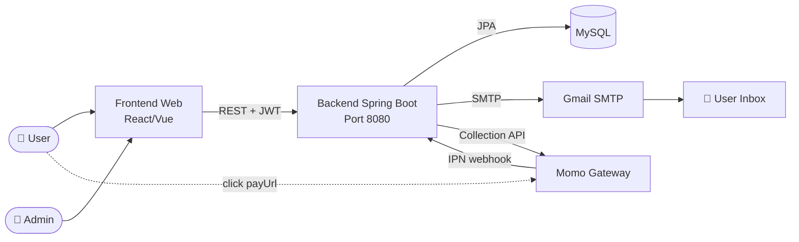
```mermaid
flowchart LR
    User([👤 User])
    Admin([👑 Admin])
    FE[Frontend Web<br/>React/Vue]
    BE[Backend Spring Boot<br/>Port 8080]
    DB[(MySQL)]
    Mail[Gmail SMTP]
    Momo[Momo Gateway]
    Inbox[📧 User Inbox]

    User --> FE
    Admin --> FE
    FE -->|REST + JWT| BE
    BE -->|JPA| DB
    BE -->|SMTP| Mail
    Mail --> Inbox
    BE -->|Collection API| Momo
    Momo -->|IPN webhook| BE
    User -.->|click payUrl| Momo
```

---

## 2. USER FLOW

### 2.1. Đăng ký + xác thực email

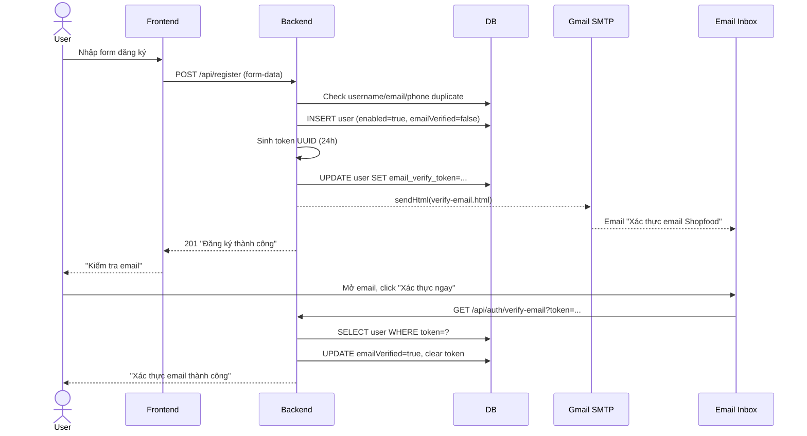
```mermaid
sequenceDiagram
    actor U as User
    participant FE as Frontend
    participant BE as Backend
    participant DB
    participant Mail as Gmail SMTP
    participant Inbox as Email Inbox

    U->>FE: Nhập form đăng ký
    FE->>BE: POST /api/register (form-data)
    BE->>DB: Check username/email/phone duplicate
    BE->>DB: INSERT user (enabled=true, emailVerified=false)
    BE->>BE: Sinh token UUID (24h)
    BE->>DB: UPDATE user SET email_verify_token=...
    BE-->>Mail: sendHtml(verify-email.html)
    Mail-->>Inbox: Email "Xác thực email Shopfood"
    BE-->>FE: 201 "Đăng ký thành công"
    FE-->>U: "Kiểm tra email"

    U->>Inbox: Mở email, click "Xác thực ngay"
    Inbox->>BE: GET /api/auth/verify-email?token=...
    BE->>DB: SELECT user WHERE token=?
    BE->>DB: UPDATE emailVerified=true, clear token
    BE-->>U: "Xác thực email thành công"
```

### 2.2. Đăng nhập + refresh token

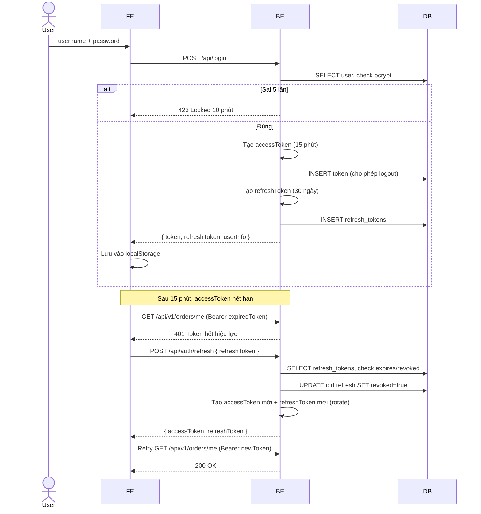
```mermaid
sequenceDiagram
    actor U as User
    participant FE
    participant BE
    participant DB

    U->>FE: username + password
    FE->>BE: POST /api/login
    BE->>DB: SELECT user, check bcrypt
    alt Sai 5 lần
        BE-->>FE: 423 Locked 10 phút
    else Đúng
        BE->>BE: Tạo accessToken (15 phút)
        BE->>DB: INSERT token (cho phép logout)
        BE->>BE: Tạo refreshToken (30 ngày)
        BE->>DB: INSERT refresh_tokens
        BE-->>FE: { token, refreshToken, userInfo }
        FE->>FE: Lưu vào localStorage
    end

    Note over FE,BE: Sau 15 phút, accessToken hết hạn

    FE->>BE: GET /api/v1/orders/me (Bearer expiredToken)
    BE-->>FE: 401 Token hết hiệu lực
    FE->>BE: POST /api/auth/refresh { refreshToken }
    BE->>DB: SELECT refresh_tokens, check expires/revoked
    BE->>DB: UPDATE old refresh SET revoked=true
    BE->>BE: Tạo accessToken mới + refreshToken mới (rotate)
    BE-->>FE: { accessToken, refreshToken }
    FE->>BE: Retry GET /api/v1/orders/me (Bearer newToken)
    BE-->>FE: 200 OK
```

### 2.3. Quên mật khẩu

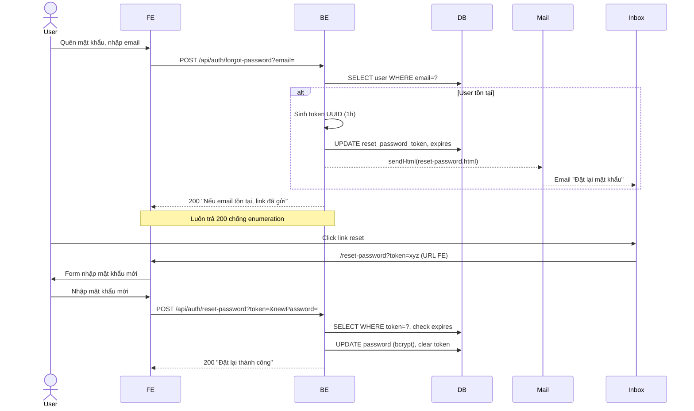
```mermaid
sequenceDiagram
    actor U as User
    participant FE
    participant BE
    participant DB
    participant Mail
    participant Inbox

    U->>FE: Quên mật khẩu, nhập email
    FE->>BE: POST /api/auth/forgot-password?email=
    BE->>DB: SELECT user WHERE email=?
    alt User tồn tại
        BE->>BE: Sinh token UUID (1h)
        BE->>DB: UPDATE reset_password_token, expires
        BE-->>Mail: sendHtml(reset-password.html)
        Mail-->>Inbox: Email "Đặt lại mật khẩu"
    end
    BE-->>FE: 200 "Nếu email tồn tại, link đã gửi"
    Note over BE,FE: Luôn trả 200 chống enumeration

    U->>Inbox: Click link reset
    Inbox->>FE: /reset-password?token=xyz (URL FE)
    FE->>U: Form nhập mật khẩu mới
    U->>FE: Nhập mật khẩu mới
    FE->>BE: POST /api/auth/reset-password?token=&newPassword=
    BE->>DB: SELECT WHERE token=?, check expires
    BE->>DB: UPDATE password (bcrypt), clear token
    BE-->>FE: 200 "Đặt lại thành công"
```

### 2.4. Mua hàng đầy đủ (Checkout)

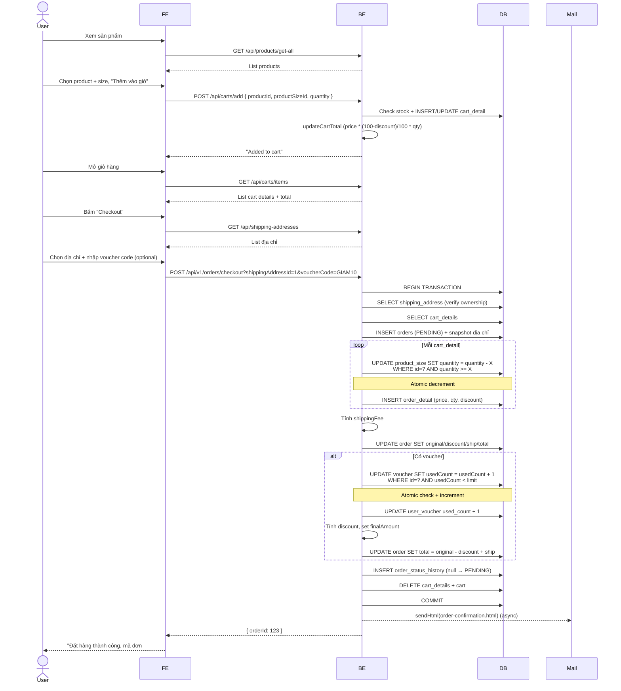
```mermaid
sequenceDiagram
    actor U as User
    participant FE
    participant BE
    participant DB

    U->>FE: Xem sản phẩm
    FE->>BE: GET /api/products/get-all
    BE-->>FE: List products

    U->>FE: Chọn product + size, "Thêm vào giỏ"
    FE->>BE: POST /api/carts/add { productId, productSizeId, quantity }
    BE->>DB: Check stock + INSERT/UPDATE cart_detail
    BE->>BE: updateCartTotal (price * (100-discount)/100 * qty)
    BE-->>FE: "Added to cart"

    U->>FE: Mở giỏ hàng
    FE->>BE: GET /api/carts/items
    BE-->>FE: List cart details + total

    U->>FE: Bấm "Checkout"
    FE->>BE: GET /api/shipping-addresses
    BE-->>FE: List địa chỉ
    U->>FE: Chọn địa chỉ + nhập voucher code (optional)
    FE->>BE: POST /api/v1/orders/checkout?shippingAddressId=1&voucherCode=GIAM10

    BE->>DB: BEGIN TRANSACTION
    BE->>DB: SELECT shipping_address (verify ownership)
    BE->>DB: SELECT cart_details
    BE->>DB: INSERT orders (PENDING) + snapshot địa chỉ
    loop Mỗi cart_detail
        BE->>DB: UPDATE product_size SET quantity = quantity - X<br/>WHERE id=? AND quantity >= X
        Note over BE,DB: Atomic decrement
        BE->>DB: INSERT order_detail (price, qty, discount)
    end
    BE->>BE: Tính shippingFee
    BE->>DB: UPDATE order SET original/discount/ship/total
    alt Có voucher
        BE->>DB: UPDATE voucher SET usedCount = usedCount + 1<br/>WHERE id=? AND usedCount < limit
        Note over BE,DB: Atomic check + increment
        BE->>DB: UPDATE user_voucher used_count + 1
        BE->>BE: Tính discount, set finalAmount
        BE->>DB: UPDATE order SET total = original - discount + ship
    end
    BE->>DB: INSERT order_status_history (null → PENDING)
    BE->>DB: DELETE cart_details + cart
    BE->>DB: COMMIT
    BE-->>Mail: sendHtml(order-confirmation.html) (async)
    BE-->>FE: { orderId: 123 }

    FE-->>U: "Đặt hàng thành công, mã đơn #123"
```

### 2.5. Thanh toán Momo

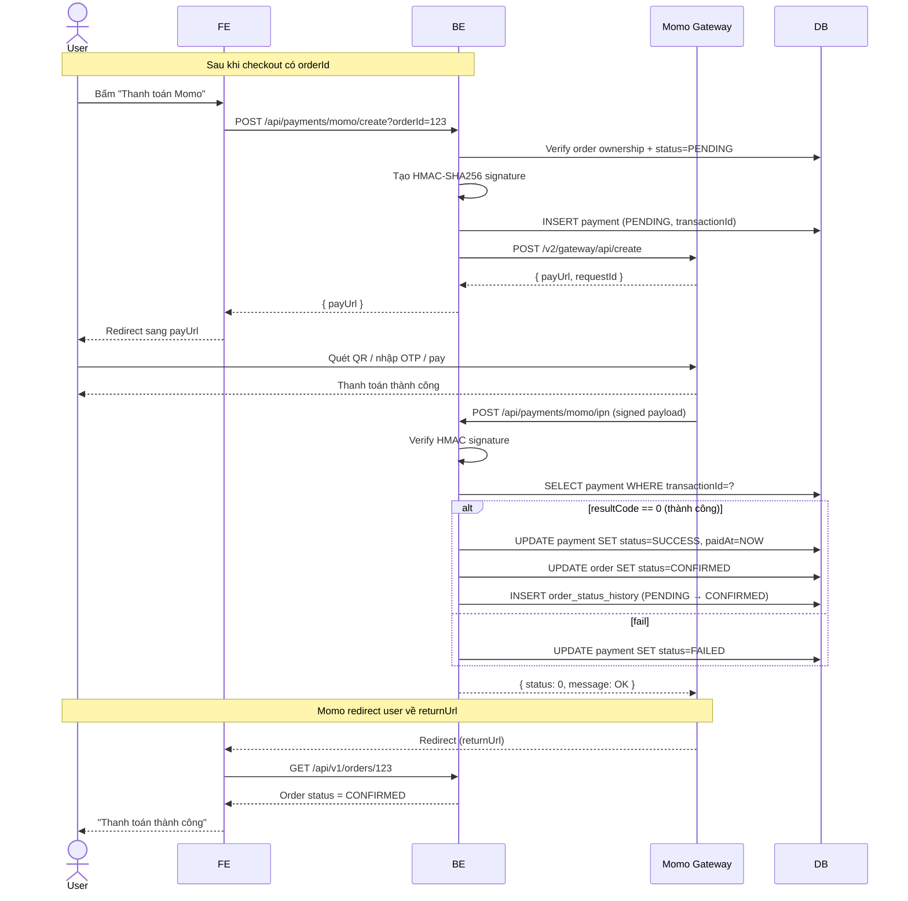
```mermaid
sequenceDiagram
    actor U as User
    participant FE
    participant BE
    participant Momo as Momo Gateway
    participant DB

    Note over U,BE: Sau khi checkout có orderId
    U->>FE: Bấm "Thanh toán Momo"
    FE->>BE: POST /api/payments/momo/create?orderId=123
    BE->>DB: Verify order ownership + status=PENDING
    BE->>BE: Tạo HMAC-SHA256 signature
    BE->>DB: INSERT payment (PENDING, transactionId)
    BE->>Momo: POST /v2/gateway/api/create
    Momo-->>BE: { payUrl, requestId }
    BE-->>FE: { payUrl }

    FE-->>U: Redirect sang payUrl
    U->>Momo: Quét QR / nhập OTP / pay
    Momo-->>U: Thanh toán thành công

    Momo->>BE: POST /api/payments/momo/ipn (signed payload)
    BE->>BE: Verify HMAC signature
    BE->>DB: SELECT payment WHERE transactionId=?
    alt resultCode == 0 (thành công)
        BE->>DB: UPDATE payment SET status=SUCCESS, paidAt=NOW
        BE->>DB: UPDATE order SET status=CONFIRMED
        BE->>DB: INSERT order_status_history (PENDING → CONFIRMED)
    else fail
        BE->>DB: UPDATE payment SET status=FAILED
    end
    BE-->>Momo: { status: 0, message: OK }

    Note over U,Momo: Momo redirect user về returnUrl
    Momo-->>FE: Redirect (returnUrl)
    FE->>BE: GET /api/v1/orders/123
    BE-->>FE: Order status = CONFIRMED
    FE-->>U: "Thanh toán thành công"
```

### 2.6. Cancel order + rollback

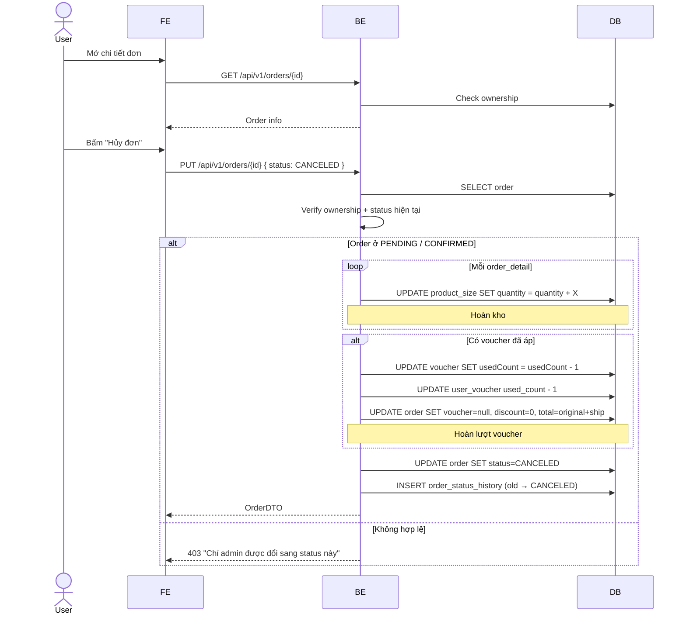
```mermaid
sequenceDiagram
    actor U as User
    participant FE
    participant BE
    participant DB

    U->>FE: Mở chi tiết đơn
    FE->>BE: GET /api/v1/orders/{id}
    BE->>DB: Check ownership
    BE-->>FE: Order info

    U->>FE: Bấm "Hủy đơn"
    FE->>BE: PUT /api/v1/orders/{id} { status: CANCELED }
    BE->>DB: SELECT order
    BE->>BE: Verify ownership + status hiện tại

    alt Order ở PENDING / CONFIRMED
        loop Mỗi order_detail
            BE->>DB: UPDATE product_size SET quantity = quantity + X
            Note over BE,DB: Hoàn kho
        end
        alt Có voucher đã áp
            BE->>DB: UPDATE voucher SET usedCount = usedCount - 1
            BE->>DB: UPDATE user_voucher used_count - 1
            BE->>DB: UPDATE order SET voucher=null, discount=0, total=original+ship
            Note over BE,DB: Hoàn lượt voucher
        end
        BE->>DB: UPDATE order SET status=CANCELED
        BE->>DB: INSERT order_status_history (old → CANCELED)
        BE-->>FE: OrderDTO
    else Không hợp lệ
        BE-->>FE: 403 "Chỉ admin được đổi sang status này"
    end
```

---

## 3. ADMIN FLOW

### 3.1. Quản lý sản phẩm

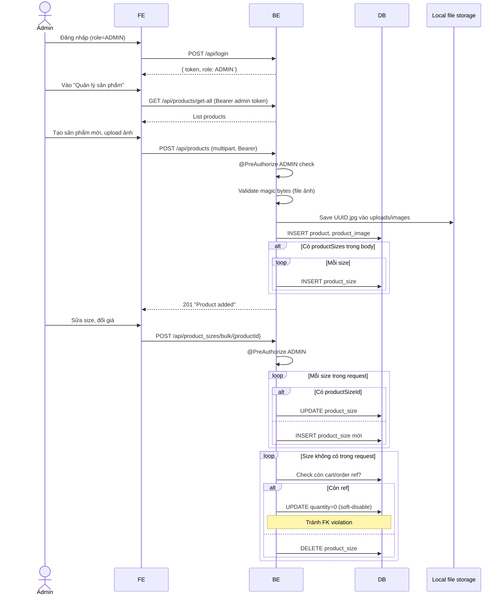
```mermaid
sequenceDiagram
    actor A as Admin
    participant FE
    participant BE
    participant DB
    participant FS as Local file storage

    A->>FE: Đăng nhập (role=ADMIN)
    FE->>BE: POST /api/login
    BE-->>FE: { token, role: ADMIN }

    A->>FE: Vào "Quản lý sản phẩm"
    FE->>BE: GET /api/products/get-all (Bearer admin token)
    BE-->>FE: List products

    A->>FE: Tạo sản phẩm mới, upload ảnh
    FE->>BE: POST /api/products (multipart, Bearer)
    BE->>BE: @PreAuthorize ADMIN check
    BE->>BE: Validate magic bytes (file ảnh)
    BE->>FS: Save UUID.jpg vào uploads/images
    BE->>DB: INSERT product, product_image
    alt Có productSizes trong body
        loop Mỗi size
            BE->>DB: INSERT product_size
        end
    end
    BE-->>FE: 201 "Product added"

    A->>FE: Sửa size, đổi giá
    FE->>BE: POST /api/product_sizes/bulk/{productId}
    BE->>BE: @PreAuthorize ADMIN
    loop Mỗi size trong request
        alt Có productSizeId
            BE->>DB: UPDATE product_size
        else
            BE->>DB: INSERT product_size mới
        end
    end
    loop Size không có trong request
        BE->>DB: Check còn cart/order ref?
        alt Còn ref
            BE->>DB: UPDATE quantity=0 (soft-disable)
            Note over BE,DB: Tránh FK violation
        else
            BE->>DB: DELETE product_size
        end
    end
```

### 3.2. Quản lý voucher

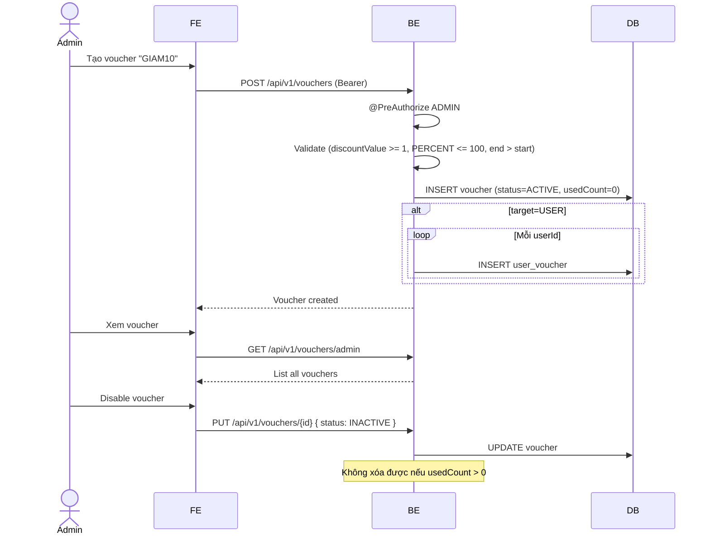
```mermaid
sequenceDiagram
    actor A as Admin
    participant FE
    participant BE
    participant DB

    A->>FE: Tạo voucher "GIAM10"
    FE->>BE: POST /api/v1/vouchers (Bearer)
    BE->>BE: @PreAuthorize ADMIN
    BE->>BE: Validate (discountValue >= 1, PERCENT <= 100, end > start)
    BE->>DB: INSERT voucher (status=ACTIVE, usedCount=0)
    alt target=USER
        loop Mỗi userId
            BE->>DB: INSERT user_voucher
        end
    end
    BE-->>FE: Voucher created

    A->>FE: Xem voucher
    FE->>BE: GET /api/v1/vouchers/admin
    BE-->>FE: List all vouchers

    A->>FE: Disable voucher
    FE->>BE: PUT /api/v1/vouchers/{id} { status: INACTIVE }
    BE->>DB: UPDATE voucher
    Note over BE: Không xóa được nếu usedCount > 0
```

### 3.3. Quản lý đơn hàng

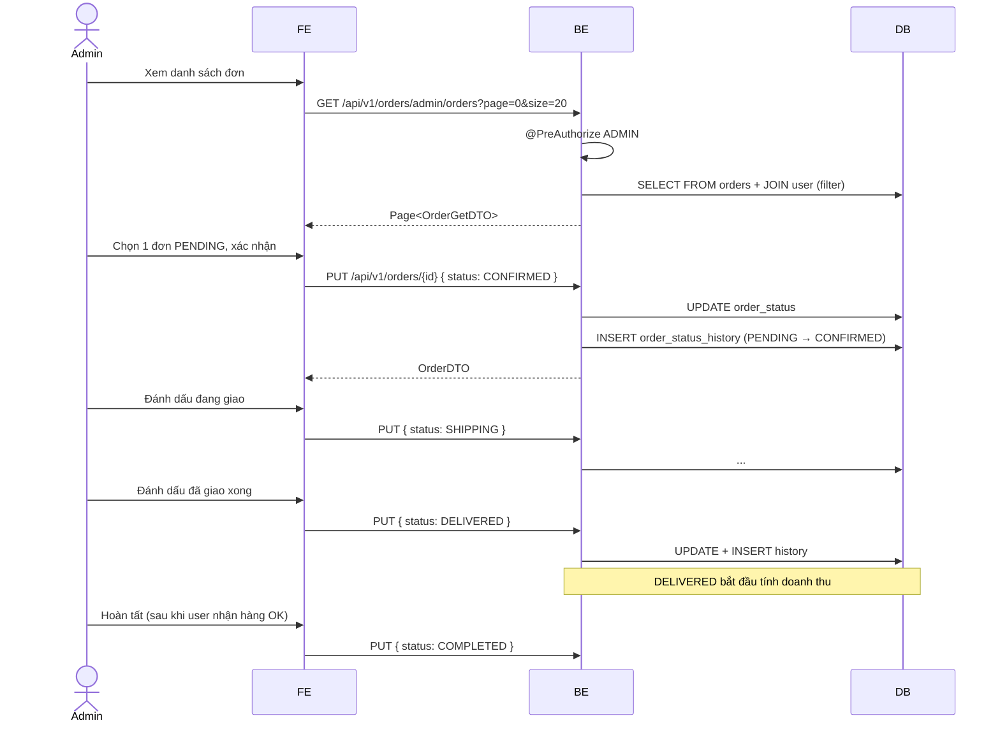
```mermaid
sequenceDiagram
    actor A as Admin
    participant FE
    participant BE
    participant DB

    A->>FE: Xem danh sách đơn
    FE->>BE: GET /api/v1/orders/admin/orders?page=0&size=20
    BE->>BE: @PreAuthorize ADMIN
    BE->>DB: SELECT FROM orders + JOIN user (filter)
    BE-->>FE: Page<OrderGetDTO>

    A->>FE: Chọn 1 đơn PENDING, xác nhận
    FE->>BE: PUT /api/v1/orders/{id} { status: CONFIRMED }
    BE->>DB: UPDATE order_status
    BE->>DB: INSERT order_status_history (PENDING → CONFIRMED)
    BE-->>FE: OrderDTO

    A->>FE: Đánh dấu đang giao
    FE->>BE: PUT { status: SHIPPING }
    BE->>DB: ...

    A->>FE: Đánh dấu đã giao xong
    FE->>BE: PUT { status: DELIVERED }
    BE->>DB: UPDATE + INSERT history
    Note over BE,DB: DELIVERED bắt đầu tính doanh thu

    A->>FE: Hoàn tất (sau khi user nhận hàng OK)
    FE->>BE: PUT { status: COMPLETED }
```

### 3.4. Doanh thu

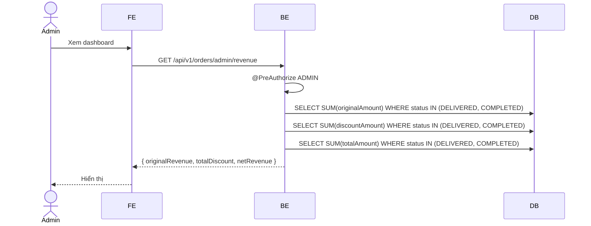
```mermaid
sequenceDiagram
    actor A as Admin
    participant FE
    participant BE
    participant DB

    A->>FE: Xem dashboard
    FE->>BE: GET /api/v1/orders/admin/revenue
    BE->>BE: @PreAuthorize ADMIN
    BE->>DB: SELECT SUM(originalAmount) WHERE status IN (DELIVERED, COMPLETED)
    BE->>DB: SELECT SUM(discountAmount) WHERE status IN (DELIVERED, COMPLETED)
    BE->>DB: SELECT SUM(totalAmount) WHERE status IN (DELIVERED, COMPLETED)
    BE-->>FE: { originalRevenue, totalDiscount, netRevenue }
    FE-->>A: Hiển thị
```

### 3.5. Gửi notification mass

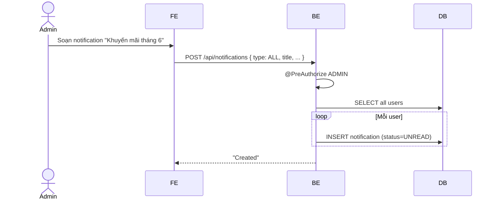
```mermaid
sequenceDiagram
    actor A as Admin
    participant FE
    participant BE
    participant DB

    A->>FE: Soạn notification "Khuyến mãi tháng 6"
    FE->>BE: POST /api/notifications { type: ALL, title, ... }
    BE->>BE: @PreAuthorize ADMIN
    BE->>DB: SELECT all users
    loop Mỗi user
        BE->>DB: INSERT notification (status=UNREAD)
    end
    BE-->>FE: "Created"
```

---

## 4. State machine — OrderStatus

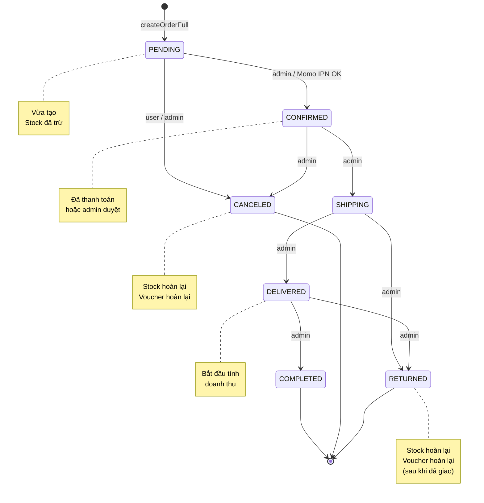
```mermaid
stateDiagram-v2
    [*] --> PENDING: createOrderFull
    PENDING --> CONFIRMED: admin / Momo IPN OK
    PENDING --> CANCELED: user / admin
    CONFIRMED --> SHIPPING: admin
    CONFIRMED --> CANCELED: admin
    SHIPPING --> DELIVERED: admin
    SHIPPING --> RETURNED: admin
    DELIVERED --> COMPLETED: admin
    DELIVERED --> RETURNED: admin
    COMPLETED --> [*]
    CANCELED --> [*]
    RETURNED --> [*]

    note right of PENDING
        Vừa tạo
        Stock đã trừ
    end note

    note right of CONFIRMED
        Đã thanh toán
        hoặc admin duyệt
    end note

    note right of DELIVERED
        Bắt đầu tính
        doanh thu
    end note

    note right of CANCELED
        Stock hoàn lại
        Voucher hoàn lại
    end note

    note right of RETURNED
        Stock hoàn lại
        Voucher hoàn lại
        (sau khi đã giao)
    end note
```

---

## 5. Token lifecycle

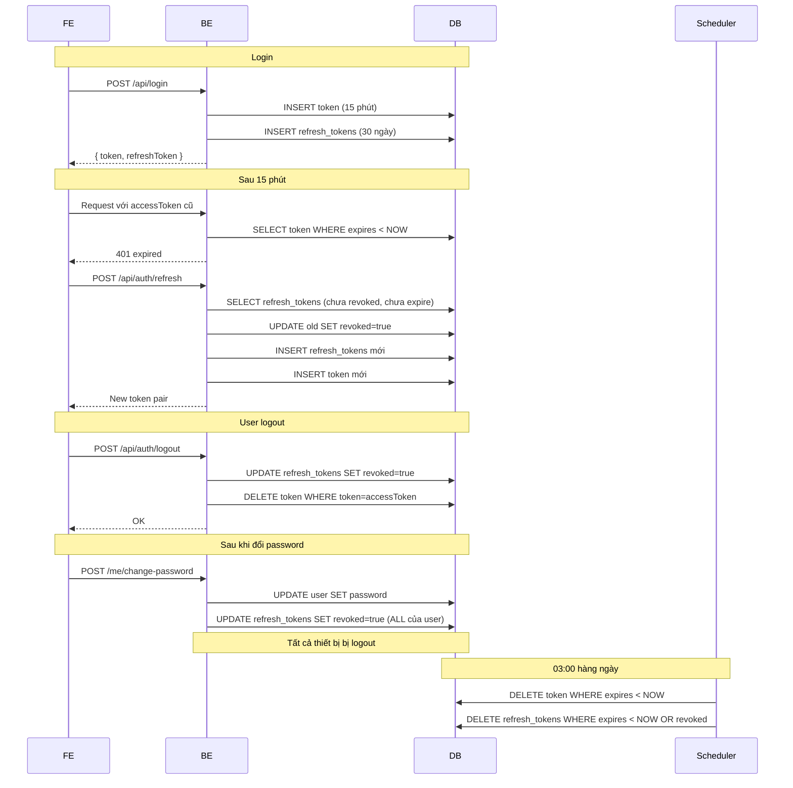
```mermaid
sequenceDiagram
    participant FE
    participant BE
    participant DB
    participant Cron as Scheduler

    Note over FE,DB: Login
    FE->>BE: POST /api/login
    BE->>DB: INSERT token (15 phút)
    BE->>DB: INSERT refresh_tokens (30 ngày)
    BE-->>FE: { token, refreshToken }

    Note over FE,DB: Sau 15 phút
    FE->>BE: Request với accessToken cũ
    BE->>DB: SELECT token WHERE expires < NOW
    BE-->>FE: 401 expired

    FE->>BE: POST /api/auth/refresh
    BE->>DB: SELECT refresh_tokens (chưa revoked, chưa expire)
    BE->>DB: UPDATE old SET revoked=true
    BE->>DB: INSERT refresh_tokens mới
    BE->>DB: INSERT token mới
    BE-->>FE: New token pair

    Note over FE,DB: User logout
    FE->>BE: POST /api/auth/logout
    BE->>DB: UPDATE refresh_tokens SET revoked=true
    BE->>DB: DELETE token WHERE token=accessToken
    BE-->>FE: OK

    Note over FE,DB: Sau khi đổi password
    FE->>BE: POST /me/change-password
    BE->>DB: UPDATE user SET password
    BE->>DB: UPDATE refresh_tokens SET revoked=true (ALL của user)
    Note over BE,DB: Tất cả thiết bị bị logout

    Note over Cron,DB: 03:00 hàng ngày
    Cron->>DB: DELETE token WHERE expires < NOW
    Cron->>DB: DELETE refresh_tokens WHERE expires < NOW OR revoked
```

---

## 6. Voucher race condition (atomic)

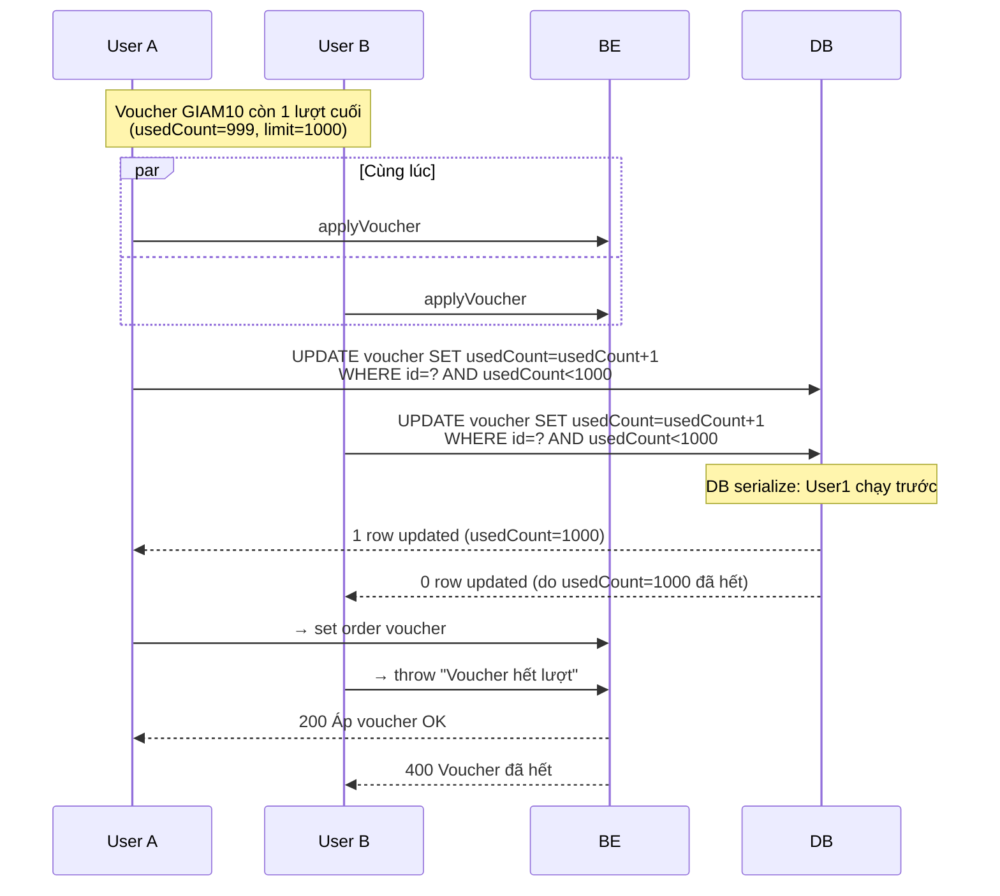
```mermaid
sequenceDiagram
    participant User1 as User A
    participant User2 as User B
    participant BE
    participant DB

    Note over User1,User2: Voucher GIAM10 còn 1 lượt cuối<br/>(usedCount=999, limit=1000)
    par Cùng lúc
        User1->>BE: applyVoucher
    and
        User2->>BE: applyVoucher
    end

    User1->>DB: UPDATE voucher SET usedCount=usedCount+1<br/>WHERE id=? AND usedCount<1000
    User2->>DB: UPDATE voucher SET usedCount=usedCount+1<br/>WHERE id=? AND usedCount<1000

    Note over DB: DB serialize: User1 chạy trước
    DB-->>User1: 1 row updated (usedCount=1000)
    DB-->>User2: 0 row updated (do usedCount=1000 đã hết)

    User1->>BE: → set order voucher
    User2->>BE: → throw "Voucher hết lượt"
    BE-->>User1: 200 Áp voucher OK
    BE-->>User2: 400 Voucher đã hết
```

---

## Tóm tắt

- **User flow**: Register → Verify email → Login → Browse → Cart → Checkout → Payment → Track order
- **Admin flow**: Login → Manage products/sizes → Create voucher → Process orders (PENDING → DELIVERED → COMPLETED) → Xem doanh thu
- **Token**: Access 15p, Refresh 30 ngày, rotate-on-use, scheduler dọn 03:00 mỗi ngày
- **OrderStatus**: 7 trạng thái, audit log mỗi lần đổi
- **Race-free**: Stock decrement + voucher usage đều atomic
- **Email**: Verify, reset password, order confirmation đều dùng template Thymeleaf gửi qua Gmail SMTP
